# FCN.tensorflow
Tensorflow implementation of [Fully Convolutional Networks for Semantic Segmentation](http://arxiv.org/pdf/1605.06211v1.pdf) (FCNs). 

The implementation is largely based on the reference code provided by the authors of the paper [link](https://github.com/shelhamer/fcn.berkeleyvision.org). The model was applied on the Scene Parsing Challenge dataset provided by MIT [http://sceneparsing.csail.mit.edu/](http://sceneparsing.csail.mit.edu/).

1. [Prerequisites](#prerequisites)
2. [Results](#results)
3. [Observations](#observations)
4. [Useful links](#useful-links)

## Prerequisites
 - The results were obtained after training for ~6-7 hrs on a 12GB TitanX.
 - The code was originally written and tested with `tensorflow0.11` and `python2.7`. 
 The tf.summary calls have been updated to work with tensorflow version 0.12. To work with older versions of tensorflow use branch [tf.0.11_compatible](https://github.com/shekkizh/FCN.tensorflow/tree/tf.0.11_compatible).
 - Some of the problems while working with tensorflow1.0 and in windows have been discussed in [Issue #9](https://github.com/shekkizh/FCN.tensorflow/issues/9).
 - To train model simply execute `python FCN.py`
 - To visualize results for a random batch of images use flag `--mode=visualize`
 - `debug` flag can be set during training to add information regarding activations, gradients, variables etc.
 - The [IPython notebook](https://github.com/shekkizh/FCN.tensorflow/blob/master/logs/images/Image_Cmaped.ipynb) in logs folder can be used to view results in color as below.

## Results
Results were obtained by training the model in batches of 2 with resized image of 256x256. Note that although the training is done at this image size - Nothing prevents the model from working on arbitrary sized images. No post processing was done on the predicted images. Training was done for 9 epochs - The shorter training time explains why certain concepts seem semantically understood by the model while others were not. Results below are from randomly chosen images from validation dataset.

Pretty much used the same network design as in the reference model implementation of the paper in caffe. The weights for the new layers added were initialized with small values, and the learning was done using Adam Optimizer (Learning rate = 1e-4). 

  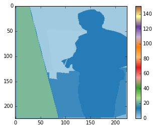 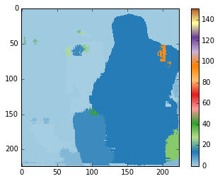

  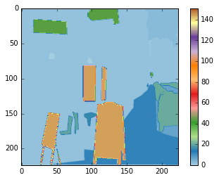 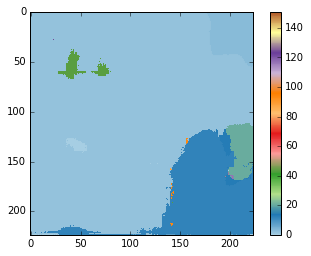

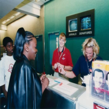  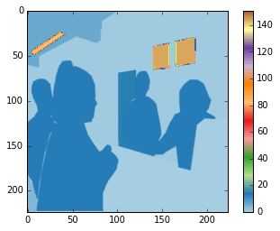 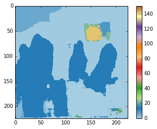

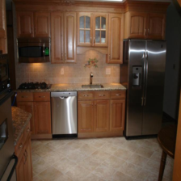  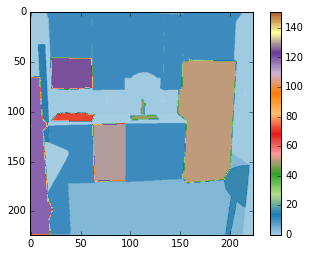 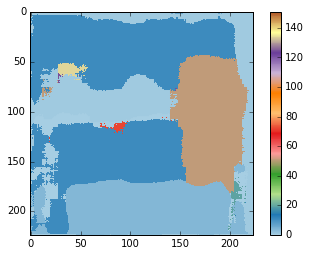

   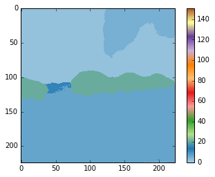

## Observations
 - The small batch size was necessary to fit the training model in memory but explains the slow learning
 - Concepts that had many examples seem to be correctly identified and segmented - in the example above you can see that cars, persons were identified better. I believe this can be solved by training for longer epochs.
 - Also the resizing of images cause loss of information - you can notice this in the fact smaller objects are segmented with less accuracy.

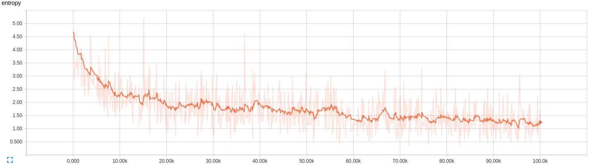

Now for the gradients,
  - If you closely watch the gradients you will notice the inital training is almost entirely on the new layers added - it is only after these layers are reasonably trained do we see the VGG layers get some gradient flow. This is understandable as changes the new layers affect the loss objective much more in the beginning.
  - The earlier layers of the netowrk are initialized with VGG weights and so conceptually would require less tuning unless the train data is extremely varied - which in this case is not.
  - The first layer of convolutional model captures low level information and since this entrirely dataset dependent you notice the gradients adjusting the first layer weights to accustom the model to the dataset.
  - The other conv layers from VGG have very small gradients flowing as the concepts captured here are good enough for our end objective - Segmentation. 
  - This is the core reason **Transfer Learning** works so well. Just thought of pointing this out while here.

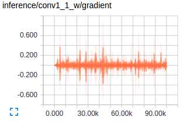  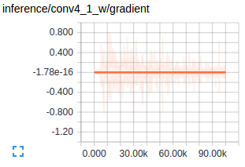    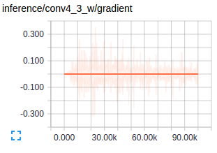

## Useful Links
- Video of the presentaion given by the authors on the paper - [link](http://techtalks.tv/talks/fully-convolutional-networks-for-semantic-segmentation/61606/) 
