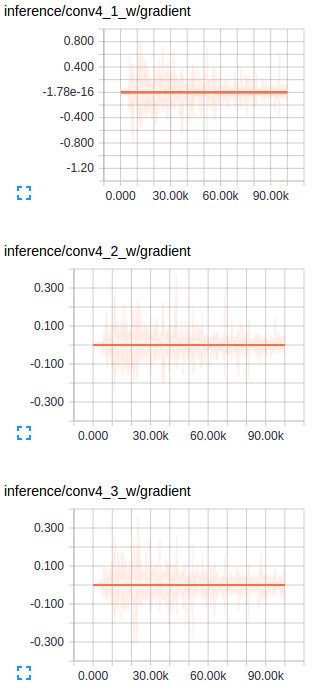

# FCN.tensorflow
Tensorflow implementation of [Fully Convolutional Networks for Semantic Segmentation](http://arxiv.org/pdf/1605.06211v1.pdf) (FCNs). 

The implementation is largely based on the reference code provided by the authors of the paper [link](https://github.com/shelhamer/fcn.berkeleyvision.org). The model was applied on the Scene Parsing Challenge dataset provided by MIT [http://sceneparsing.csail.mit.edu/](http://sceneparsing.csail.mit.edu/).

1. [Results](#results)
2. [Observations](#observations)
3. [Useful links](#useful-links)

Readme is still under edit :exclamation:

##Results
Results were obtained by training the model in batches of 2 with resized image of 256x256. Note that although the training is done at this image size - Nothing prevents the model from working on arbitrary sized images. No post processing was done on the predicted images. Training was done for 9 epochs - The shorter training time explains why certain concepts seem semantically understood by the model while others were not. Results below are from randomly chosen images from validation dataset.

   

   

   

   

   

##Observations

##Useful Links
- Video of the presentaion given by the authors on the paper - [link](http://techtalks.tv/talks/fully-convolutional-networks-for-semantic-segmentation/61606/) 
